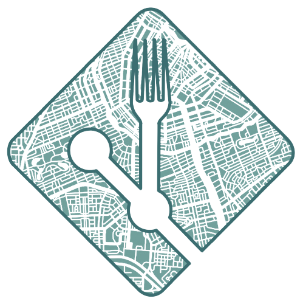
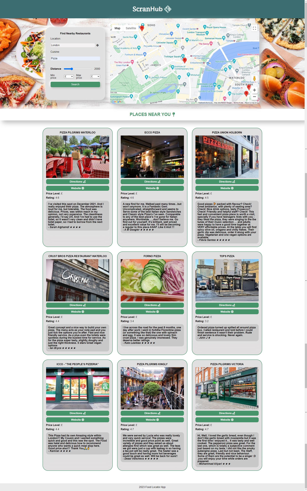

# ScranHub



A Food App involving APIs and an interactive front-end application.

---

## Description

Our idea was to build a food locator application with the purpose to allow users to search for local food services or restaurants within a specified distance. They would then get results depending on their key words they used to search, the distance inputted and the price range; results show business name, price range, rating and even a relevant review. It utilises a clean and simple looking UI to deliver local food areas directly to the user.

The motivation behind this project was to work for the first time in a team handling different parts of the project, from design and branding to logic in JavaScript; we also wanted to deepend our knowledge of third-party APIs. The reason we chose the Food App was we wanted to use the Google API and finding food while out and about is common problem many of us run into, one that Google Maps does show its UI is particularly user friendly and those less experienced with Technology may struggle.

We learnt how to work and collaborate as a team, including solving issues from github conflicts to API requet errors. All while continuing our knowledge in various fields we were in and learning tips and tricks from eacher throughout.

## Screenshots




## Installation

In order to use this yourself, you will need your own Google API Key which can be created [here](https://console.cloud.google.com/project/_/google/maps-apis/), a keys.js file must be created a nested inside the js folder.

Follow syntax will need to placed in keys.js in order for it work, with your very own API key parsed.

```javascript
const keyAPI = "YOUR_API_KEY_HERE"
```

You will need to be set up with temp acces from https://cors-anywhere.herokuapp.com/

## Usage

To use the application head to [here](!https://jackstockwell.github.io/scranhub/). This will direct you to the homepage where you will be presented with a user-interface. Fill in the search box area with the required infomation that you are prompted with. Once done, hit search and your results will load below, they include directions via Google Maps, as well as some additional infomation like a picture, their rating etc.

## Features

Key Features: 

- Google Maps API: Able to search for locations using Geolocate, query a nearby search using a Lat and Lon co-ordinate.
- Google Places API: Able to find details when given a place_id or formatted address. These details are used populate the cards with infomation.
- Geolocation via the browser.
- Fontawesome: A CSS API used to get icons to populate the page with.

## License

N/A

## Contact Information

We can be reached via GitHub.

## Acknowledgments/Credits

[Brock Herion Blog](https://brockherion.dev/blog/posts/keep-your-async-code-fast-with-promise-all/) - Was used to make the async API call.

[Fontawesome Docs](https://fontawesome.com/docs) - The Fontawesome documentation.

[Google Maps JavaScript API](https://developers.google.com/maps/documentation/javascript) - The Documentation for the Google Maps API. Used extensively to gather infomation.

[Google Places API](https://developers.google.com/maps/documentation/places/web-service/overview) - Used to query the infomation the user describes.

[Mozilla MDN](https://developer.mozilla.org/en-US/docs/Web/JavaScript) - Used for researching JavaScript, CSS and HTML syntax.

[CORS Anywhere](https://cors-anywhere.herokuapp.com/) - Allowed us to use the API.

## Contributors

[Myra-k](https://github.com/Myra-k)

[dirie93](https://github.com/dirie93)

[AJosueBN](https://github.com/AJosueBN)

[LouisJsummers](https://github.com/LouisJsummers)

[JackStockwell](https://github.com/JackStockwell)